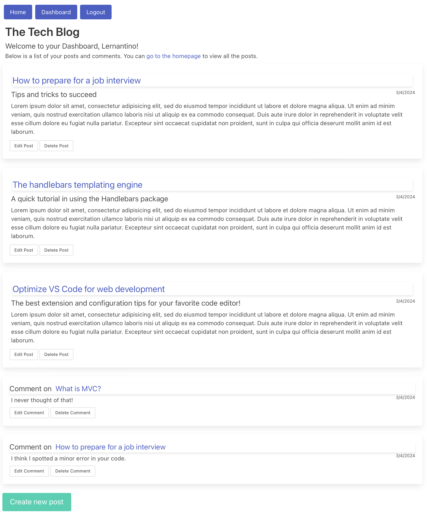

# Tech Blog

## Description
Tech Blog is a CMS-style blog site where users can create blog posts and comment on the posts of others. Users must create an account to post blogs and comments and to read other posts in their entirety. Once logged in, users have the ability to edit or delete their own posts and comments.

## Table of Contents
- [Installation](#installation)
- [Use](#use)
- [Questions](#questions)
- [License](#license)

## Installation
This is a [Node.js](https://nodejs.org/en) app that uses a [MySQL](https://www.mysql.com) database; both of these must be installed on the host computer. To install this app:

1. Clone or download this repo, open a terminal in the app directory, and type `npm install` to install the dependencies.
2. In MySQL, create a database called `ecommerce_db`.
3. In the root directory create a file `.env` and define the following environmental three environmental variables: `DB_NAME='techblog_db'`, `DB_USER='<user>'`, `DB_PASSWORD='<password>'` (with the appropriate values for `<user>` and `<password>` for your MySQL installation).
4. Start the server with the command `npm start`. The app will create three tables in the database: `blogpost`, `comment`, and `user`. Examine the code in the `models` directory for the schema of those tables (this app uses the Sequelize ORM).
5. If you wish to test the app with sample data, type `npm run seed.`

## Deployment
This app has been [deployed to Heroku](https://cls-techblog-afd27a584df0.herokuapp.com):

<https://cls-techblog-afd27a584df0.herokuapp.com>

## Use
The initial home page of the app is shown below. This screen is available to all users and depicts the navigation buttons along the top and a list of blog posts and their teaser summaries.

Further investigation of the site requires a login or the creation of a user account, either of which can be done by pressing the login button. Once logged in you have access to your dashboard, shown in the screenshot below.

The dashboard lists all the posts and comments that the user has made. From the dashboard you can edit or delete either of these, or you can create a new post.

## Questions
Reach out if you have questions that are not covered here!

- GitHub username: clstevenson
- email: chrislstevenson@gmail.com

## License
This project is licensed under the terms of the [MIT license](https://opensource.org/licenses/MIT).
